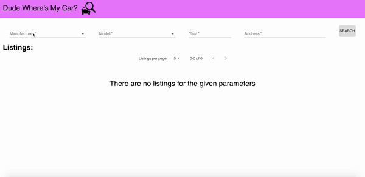

# Installations

1. Add API Key Dependencies to the project (see **Adding API Key Dependencies** below for instructions)
1. cd to the client directory (front-end)
1. Install dependencies via `npm install`
1. start the app via `npm start`
1. Head to http://localhost:3000 on the browser
1. cd to the server directory (back-end)
1. Install dependencies via `npm install`
1. run server via `npm start`
1. server will run on http://localhost:8080

### Adding API Key Dependencies

This program requires a Google Map API key as well as Marketcheck Cars Search API key.
These can be obtained here (follow the instructions on the website links):

- [Marketcheck Cars Search API](https://www.marketcheck.com/automotive)
- [Google Map API](https://developers.google.com/maps/documentation/javascript/get-api-key?utm_source=google&utm_medium=cpc&utm_campaign=FY18-Q2-global-demandgen-paidsearchonnetworkhouseads-cs-maps_contactsal_saf&utm_content=text-ad-none-none-DEV_c-CRE_284472093831-ADGP_Hybrid+%7C+AW+SEM+%7C+BKWS+~+Google+Maps+API+Key-KWID_43700035508001642-kwd-348487545330-userloc_9000960&utm_term=KW_%2Bmaps%20%2Bapi%20%2Bkey-ST_%2Bmaps+%2Bapi+%2Bkey&gclid=CjwKCAiAzuPuBRAIEiwAkkmOSM0DSZrMK0_I3azDziDUabpxvshmidDej1iZUxMkO97x3ZDhTbTWlBoCBVEQAvD_BwE) - This is used to auto-populate addresses on the **Location** textfield and obtain the latitude and longitude of the user's selected address.
   
   
  Ensure that you have the following APIs/services enabled with your associated key: **Places API and Geocoding API**.

1. Add a `.env` file under `client/` with a key-value pair of `REACT_APP_MAP_API_KEY={{INSERT GOOGLE MAPS API KEY HERE}}`
2. Add a `.env` file under `server/` with a key-value pair of `MARKETCHECK_API_KEY={{INSERT MARKETCHECK API KEY HERE}}`

# Application in Action

# Assumptions and Issues

1. The **average price** represents the average prices of the total cars for a selected make, model, year and **does not include** similar vehicles. If there is no price listed for any of the car listings then an average price will not be displayed. I have chosen not to display the price as it may give a skewed representation of the data since it would be not a true average.
2. The radius provided to the Marketcheck API is accepting an integer (in miles). The search radius is 7 miles in my queries.
3. The **dist** key provided by a response from the Marketcheck API is assumed to be a **straight line distance** between the dealership and the user's selected location in miles.
4. When populating the **Make** textfield with autocomplete options, the Marketcheck API gives only the first 50 results (limitation of search auto-complete) in alphabetical order for various makes of a car. This make list ranges from "AM General" to "Plymouth".
5. The **Model** autocomplete options is populated based on the selected make of the car. However, the Marketcheck API gives only the first 50 results as well.
    
    
   **For Example:** If the user wanted to look for a **Ford Mustang**, and the **Make** textfield has the value **Ford**. The **Model** autocomplete options only shows results up to the letter **E**. This **Mustang** option is unavailable in these options since **Mustang** is not in the first 50 models.

# Future Steps

1. Figure out a way to get all the values for my search and not be limited to the 50 result limit that I get from the API.
2. For the **Location** textfield, a map button would be available on the right side of the input. If the user clicked this button, it would open up a modal of Google Maps. The user would then have the option of using their cursor to move around the map and **click** on the location of the choice. This would be a nice functionality to have as it allows users to choose a general location on a map, rather than knowing a exact address. However, this modal would still include the location textfield at the top.
3. Currently, the application is using **front-end pagination**. This is the current implementation for two reasons:
    
    
   **Note:** Let's assume that we are querying for a Ford Mustang, 2017 model in my local area. It provides me with over 300 results.
    
    
   (1) As stated in the Marketcheck API, we can query for rows 250-300 if need be. However, the deeper you go in the result set, the slower the API will get. Although it's allowed right now to go deep, in the future, the API will block deep pagination. If you need to go way deep in the result sets via the API then API is not what you need, you need a data feed from the Marketcheck API side.
    
   (2) Since I have an Express backend with no database, I cannot store and query the information I recieved from my API easily. Nor do I have a data feed from the Marketcheck API.
    
    
   As a result, **if** I were to only send a small subset of information back to the front-end, this would be at the cost of calling the Marketcheck API and receiving over 300 results multiple times (assuming I avoid (1)).
    
    
   In my case case, it is more efficient if I were to make the API call for a particular make, model, and year and pass it to the front-end **once** and have my front end paginate the results.
    
    
   **If** I were to implement a backend pagination, this would involve storing and querying the car information from a database or having a data feed with the Marketcheck API.
4. Allow the user to input **at minimum** a car model and locaton (required field). All the types of models and years should be included in the result. This allows a user some flexibility in their search.
5. Add "Advanced Options" for the user when looking at similar cars: price range, date range, and different aspects of a car that they are looking for (number of doors / seats, mileage, etc.).
6. Add sorting buttons (i.e., sort by price, dist, etc. in ascending or descending order).
7. Add better error handling for the user's inputs (what they can and cannot type) and accounting for missing keys/values in the data from Marketcheck API.
8. Add smoother transitions every time a new search result is triggered (i.e. adding spinners every time we make a call to the backend) so that the user is aware some process is happening in the background.
9. In general, improve and have more consistent styling with the application.
